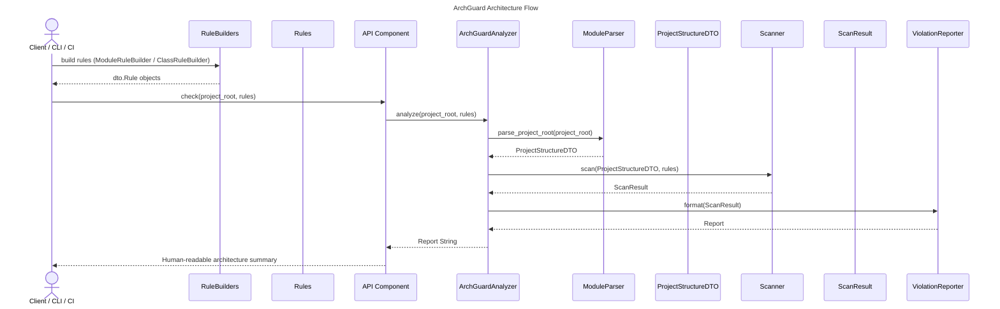

# Architecture Overview

This document describes the high-level architecture of the ArchGuard system, focusing on three primary umbrella components:

1. **RuleBuilders** – fluent DSL for constructing architectural rules
2. **API Component** – entrypoint providing a simple user-facing API for creating and running architecture checks
3. **ArchGuardAnalyzer** – core engine orchestrating project parsing, rule evaluation, and reporting

Together, they form the complete architecture-checking pipeline:

```
Rules → API → Analyzer → Parser → Scanner → Reporter → Result
```

---

# 1. RuleBuilders Component

`RuleBuilders` is responsible for providing a fluent internal DSL for defining architecture rules.
It does not perform parsing, scanning, or reporting; instead, it constructs rule objects that the system later evaluates.

## 1.1 Included Classes

### ModuleRuleBuilder

Creates rules related to modules and their allowed imports.

### ClassRuleBuilder

Creates rules related to class naming, decorators, and file residency.

Both implement the following protocols:

### ClassRuleBuilderProtocol

```python
class ClassRuleBuilderProtocol(Protocol):
    def that_reside_in(self, pattern: str) -> Self: ...
    def that_do_not_reside_in(self, pattern: str) -> Self: ...
    def should_have_name_matching(self, pattern: str) -> dto.Rule: ...
    def should_have_decorators(self, decorators: list[str]) -> dto.Rule: ...
```

### ModuleRuleBuilderProtocol

```python
class ModuleRuleBuilderProtocol(Protocol):
    def that_reside_in(self, pattern: str) -> Self: ...
    def that_do_not_reside_in(self, pattern: str) -> Self: ...
    def should_not_import(self, pattern: str) -> dto.Rule: ...
    def should_only_import(self, *patterns: str) -> dto.Rule: ...
```

## 1.2 Purpose

* Let clients define rules such as:

  ```python
  rule = module().that_reside_in("app.*").should_not_import("tests.*")
  ```
* Abstracts rule definition away from parsing/scanning concerns.
* Produces `dto.Rule` objects consumed by the analyzer.

---

# 2. API Component

The **API Component** is the entrypoint of the system.
It provides a clean, user-friendly interface that encapsulates all lower-level operations.

### Responsibilities

* Provide public functions such as:

  ```python
  def check(project_root: str, rules: list[dto.Rule]) -> str: ...
  ```
* Accept rules constructed via RuleBuilders.
* Orchestrate the entire process by delegating to ArchGuardAnalyzer.
* Serve as the stable integration surface for:

  * CLI
  * CI systems
  * Other Python programs using ArchGuard programmatically

### The API does *not*:

* Parse code
* Evaluate rules
* Format output

It delegates these tasks to `ArchGuardAnalyzer`.

---

# 3. ArchGuardAnalyzer Component

This umbrella component orchestrates the core architecture-checking pipeline.
It includes the following main classes:

* **ModuleParser**
* **Scanner**
* **ViolationReporter**

## 3.1 ModuleParser

### Responsibilities

* Walk the filesystem
* Identify modules/packages
* Parse imports
* Build dependency relationships
* Produce `ProjectStructureDTO` containing:

  * Modules
  * Dependencies
  * Additional metadata

---

## 3.2 Scanner

### Responsibilities

* Accept `ProjectStructureDTO` and list of rules
* Apply architecture rules:

  * Layered rules
  * Naming rules
  * Import restrictions
  * Dependency constraints
* Produce `ScanResult` containing violations

---

## 3.3 ViolationReporter

### Responsibilities

* Convert a `ScanResult` into:

  * Human-readable text
  * (Future) JSON / SARIF
  * (Future) Visual diagrams
* Summarize rule violations for CLI and CI output

---

# 4. System Flow

## End-to-End Steps

1. **Client** uses RuleBuilders to create rules.
2. **Client** calls API Component:

   ```python
   result = api.check(project_root, rules)
   ```
3. The API delegates to **ArchGuardAnalyzer**.
4. ArchGuardAnalyzer invokes:

   * **ModuleParser** → builds `ProjectStructureDTO`
   * **Scanner** → evaluates rules and produces `ScanResult`
   * **ViolationReporter** → formats results
5. The API returns the final human-readable report to the client.

---

# 5. Mermaid Diagram



---

# 6. Summary

The system follows a clean and modular architecture:

```
RuleBuilders → API Component → ArchGuardAnalyzer
                                → ModuleParser
                                → Scanner
                                → ViolationReporter
```

This design ensures:

* **Separation of concerns**
* **Extensibility** (new rule types, scanners, parsers)
* **Testability**
* **Stable API surface for users**
