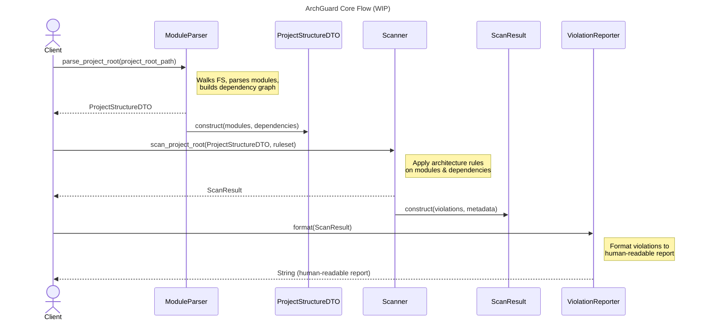

Here is an updated **FLOW.md** where the new component (named **ArchGuardAnalyzer** as the primary recommendation) is included as a dedicated subsection and integrated naturally into the document.

If you'd like a different component name, I can regenerate it instantly.

---

# Architecture Flow (WIP)

This document describes the core processing flow between the main components of the system:
**ArchGuardAnalyzer**, ... (TBD).

The pipeline analyzes a project's structure, detects architecture violations, and produces a human-readable report.

---

## 1. ArchGuardAnalyzer (Component Overview)

`archguard.analyzer`

`ArchGuardAnalyzer` is the umbrella component that encapsulates the three core classes responsible for the architecture-checking workflow:

* **ModuleParser** – Builds the project structure model.
* **Scanner** – Evaluates the structure against architecture rules.
* **ViolationReporter** – Formats detected violations for CLI/CI use.

You can think of `ArchGuardAnalyzer` as the orchestrator or processing engine that performs:

```
Parsing → Analysis → Reporting
```

It does *not* implement these operations itself; rather, it delegates to the three internal classes and coordinates the overall flow.

---

## 2. High-Level Processing Flow

1. **ModuleParser** parses the project and constructs a DTO containing all detected modules and their dependencies.
2. **Scanner** receives that DTO and applies a list of architecture rules, producing a structured violation list.
3. **ViolationReporter** transforms the scan result into a readable output for humans or CI.

---

## 3. Mermaid Diagram



---

## 4. Detailed Component Responsibilities

### **ModuleParser**

* Traverses the project filesystem.
* Detects modules, files, and imports.
* Produces `ProjectRoot` containing:

  * Module list
  * Dependency graph
  * Relevant metadata for rule checks

---

### **Scanner**

* Receives `ProjectRoot` + rule set.
* Applies architecture rules (layer rules, naming rules, import rules, etc.).
* Produces a `ScanResult` containing:

  * Violations
  * Metadata (rule IDs, locations, etc.)

---

### **ViolationReporter**

* Accepts a `ScanResult`.
* Formats violations into:

  * Human-readable CLI output
  * (Future) JSON/SARIF formats
  * (Future) Visual diagrams

---

## 5. End-to-End Summary

```
ArchGuardAnalyzer
    → ModuleParser (parses code)
    → Scanner (checks rules)
    → ViolationReporter (formats output)
```

Or more simply:

```
Project Root → Parser → Scanner → Reporter → Final Report
```

This flow keeps parsing, analysis, and reporting independent, testable, and extensible—while `ArchGuardAnalyzer` ties them together into a coherent pipeline.
